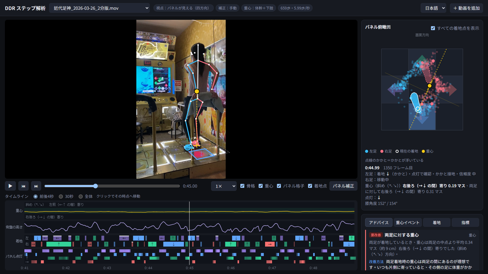
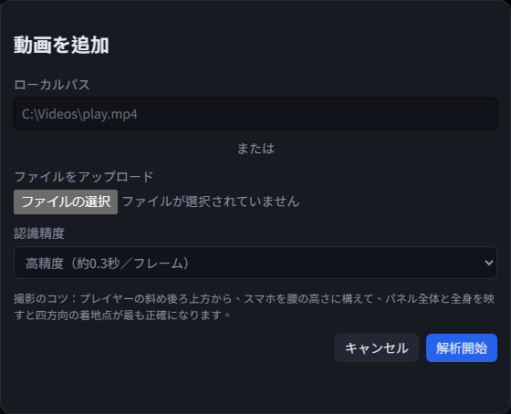
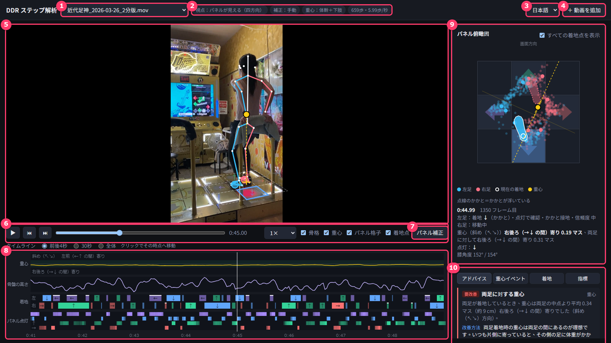
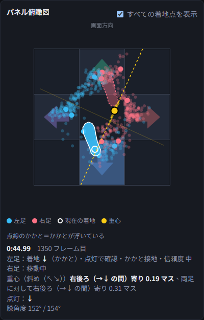
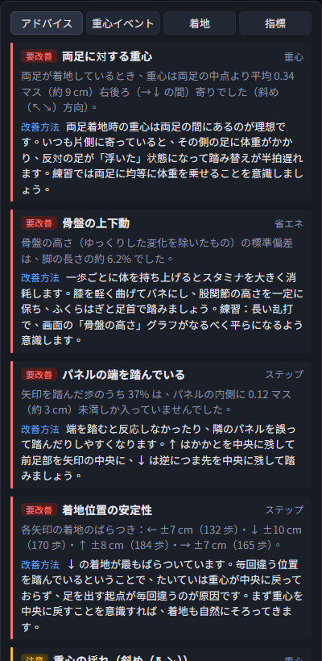
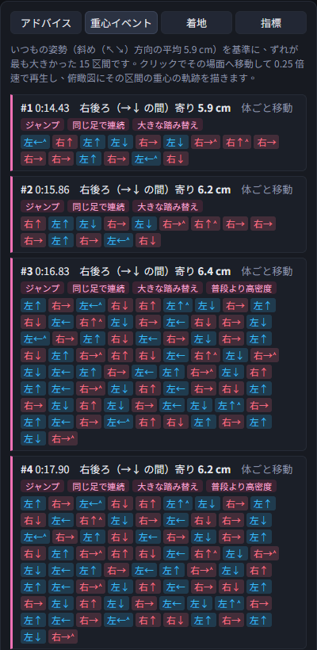
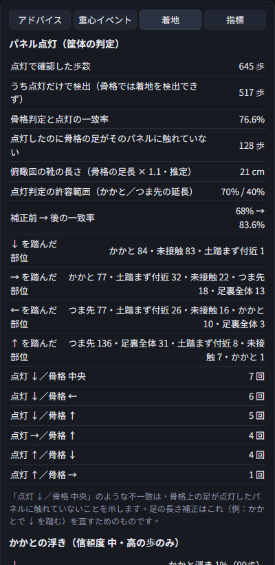
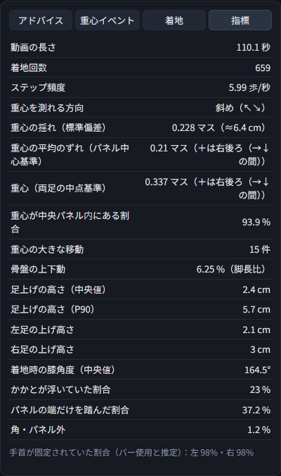
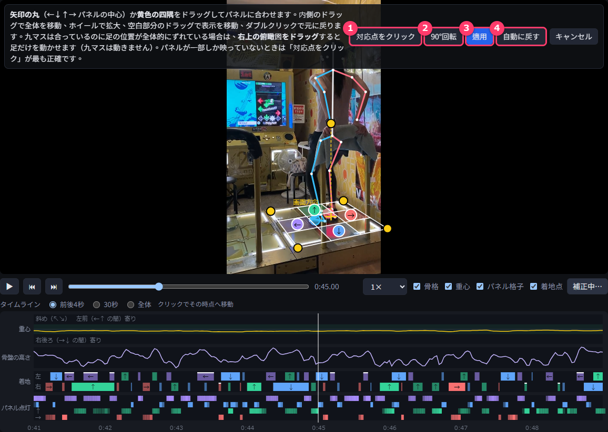
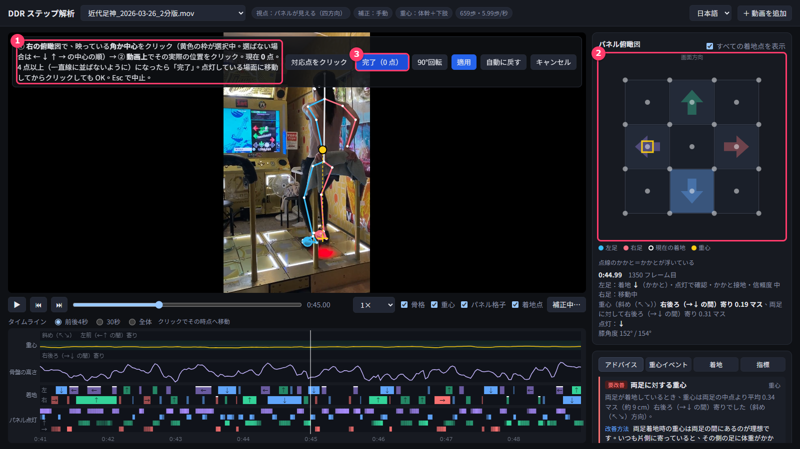

# DDR ステップ解析（DDR Step Analyzer）

**日本語** ｜ [中文](README.zh-TW.md)

DDR のプレイ動画から、骨格（人体の関節点）を使って
「実際にどこを踏んだか」「重心の動き」「かかと／つま先の使い方」を解析し、改善アドバイスを表示するツールです。

- すべて自分のパソコンの中で動きます。動画やデータが外部に送られることはありません。
- AI のサブスクリプションや有料サービスは不要です（無料のオープンソースだけを使います）。
- インターネットが必要なのは、最初のセットアップのときだけです。

## ダウンロードとインストール（Windows）

### 必要なもの

- Windows 10 または 11（64 ビット）
- メモリ 8 GB 以上、空き容量 3 GB 以上
- 最初のセットアップ時のインターネット接続

### 手順（最初の 1 回だけ）

1. **[ダウンロードページ（Releases）](https://github.com/xkamome/ddr-step-analyzer/releases/latest)** を開き、
   「Assets」の中の **`ddr-step-analyzer_v1.2.zip`** のような名前の ZIP（数字はバージョン）をクリックして保存します。
   （このページ上部の緑色の「Code」→「Download ZIP」でも同じ内容をダウンロードできます）
2. ZIP ファイルを右クリック →「すべて展開」。
   おすすめの場所：`C:\ddr-step-analyzer`
   （デスクトップや OneDrive のフォルダは、同期で遅くなることがあるので避けてください）
3. 展開したフォルダの中の **`setup.bat`** をダブルクリック。
   青い画面「Windows によって PC が保護されました」が出たら、「詳細情報」→「実行」を押してください。
4. 黒い画面で自動的にインストールが進みます（10〜20 分ほど）。
   - Python が入っていない場合は自動でインストールされます（管理者権限は不要）。
   - 骨格認識モデル（約 360 MB）がダウンロードされます。
5. 「セットアップ完了」と表示されたら、何かキーを押して画面を閉じます。
   デスクトップに **「DDR ステップ解析」** というショートカットができています。

## 使い方

### 1. 起動して動画を追加する

1. デスクトップの「DDR ステップ解析」をダブルクリック。
   黒い画面（解析サーバー）が開き、少しするとブラウザで解析画面が開きます。解析中は黒い画面を閉じないでください。
2. 右上の **「＋ 動画を追加」** を押します。

- **ローカルパス**：動画ファイルの場所を貼り付けます（エクスプローラーでファイルを Shift＋右クリック →「パスのコピー」）。
- **ファイルをアップロード**：ファイルを選んでも OK です。
- **認識精度**：通常は「高精度」。2 分の動画で 20〜40 分ほどかかります。
  急ぐときは「高速」（数分で終わりますが、足が隠れると左右を取り違えやすくなります）。
- 「解析開始」を押すと、上の選択欄に進み具合（％・残り時間）が表示されます。

### 2. 画面の見方

| 番号 | 名前 | 内容 |
|---|---|---|
| 1 | 動画の選択 | 解析済みの動画を切り替えます。解析中の動画は進み具合が表示されます |
| 2 | 解析の状態 | 視点、パネル補正の方法（手動／自動）、重心の計算方法、歩数と 1 秒あたりの歩数。**解析がうまくいったかはまずここを見ます**（下の「解析がうまくいかないとき」） |
| 3 | 言語 | 日本語／中国語の切り替え（アドバイスも切り替わります） |
| 4 | 動画を追加 | 新しい動画を解析します |
| 5 | 動画 | 骨格（青＝左、赤＝右）、重心（黄色の丸）、パネルの九マス、着地点を重ねて表示 |
| 6 | 再生操作 | 再生／コマ送り（キーボードの ← →、Shift＋← → で 1 秒）、速度（0.25× でスロー）、表示の ON／OFF |
| 7 | パネル補正 | 九マスが実際のパネルとずれているときに使います（下で説明） |
| 8 | タイムライン | 上から「重心」「骨盤の高さ」「着地」（左足・右足、色と矢印＝踏んだパネル）「パネル点灯」（←↓↑→ の 4 行）。クリックでその時点へ移動 |
| 9 | パネル俯瞰図 | 真上から見たパネルと足（下で説明） |
| 10 | 結果のタブ | アドバイス／重心イベント／着地／指標（下で説明） |

### 3. パネル俯瞰図

- **小さい点**：これまでの着地点（青＝左足、赤＝右足）。「すべての着地点を表示」で ON／OFF。
- **足の形**：いまの足の位置。白い丸は「いま着地している足」、**後ろ半分が点線ならかかとが浮いている**状態です。
- **黄色の丸と点線**：重心。斜めからの 1 台のカメラでは重心は一方向しか測れないため、「重心は黄色の点線のどこか」という意味です。
- 下の文字：いまの時刻、それぞれの足の状態（着地・どのパネル・つま先／かかと・点灯で確認できたか・信頼度）、重心のずれ、点灯しているパネル、膝の角度。

### 4. 結果のタブ

| アドバイス | 重心イベント | 着地 | 指標 |
|---|---|---|---|
|  |  |  |  |

- **アドバイス**：「要改善」「注意」「参考」「良好」の順に、根拠となる数字と**改善方法・練習方法**を表示します（高難度プレイヤー基準）。
- **重心イベント**：重心が大きく崩れた場面を 10〜20 か所選んで表示。**クリックするとその場面を 0.25 倍速で再生**し、俯瞰図にその区間の重心の動きと足の番号を描きます。
  下のタグは推定原因（ジャンプ、同じ足で連続、大きな踏み替え、普段より高密度 など）、その下はその区間の踏み順です。
- **着地**：パネルの点灯（筐体の判定）と骨格の比較、パネルごとに「つま先／かかと／足裏全体」のどこで踏んだか、かかとの浮き。
- **指標**：動画の長さ、歩数、重心の揺れ、骨盤の上下動、足上げの高さ、膝の角度などの数値一覧。

**終了**：ブラウザのタブを閉じるだけで OK です。10 秒ほどで黒い画面も自動で閉じます。

### 5. ダブルプレイ（DP）の解析

1. 「＋ 動画を追加」の **「プレイモード」** で **「ダブル（DP・2台）」** を選んでから「解析開始」します（既定はシングル）。
   一覧では DP の動画の名前の前に `[DP]` と表示されます。
2. 2 台・8 枚の矢印パネル（**1P←↓↑→**、**2P←↓↑→**）をパネルの点灯から自動で見つけます。
   まずよく光る方の台の菱形を見つけ、もう一方の台は「同じ形を横にずらして縮めたもの」として、点灯がいちばん強く重なる位置を探します。
   あまり踏まれないパネルや、バーの陰で見えないパネルも、この形から位置を推定します。
   座標は 2 台を横に並べた 1 つの座標系（P1 台の中心が (−c, 0)、P2 台の中心が (+c, 0)、各矢印は台の中心から ±1）で、
   **台の間隔 c** は 8 つの矢印の位置から自動で合わせます（画面上部に「台間隔 ○ マス」と表示）。
3. ずれているときは **「パネル補正」**。2 台それぞれに矢印の丸と黄色の四隅があるので、P1／P2 台に別々に合わせて「適用」します。
   片方の台の内側をドラッグするとその台だけ動きます。「対応点をクリック」も 2 台分の点から選べます（90°回転は DP では使えません）。

DP のときだけ表示されるもの：

| 場所 | 内容 |
|---|---|
| タイムライン「台」 | いまどの台にいるか。青＝P1 台、赤＝P2 台、黄＝移動中、灰＝中央（2 台をまたいで 0.8 秒以上） |
| 重心イベント | 重心は「いま乗っている台」の中心を基準に見ます。台をまたぐ移動は崩れとして数えず、下に **台移動（P1→P2 など）** として別に表示（クリックでスロー再生） |
| 指標 | **体幹の比較表（P1 台／P2 台／移動中／中央）**：体幹の左右の傾き、骨盤ラインに対する肩ライン、肩の中点に対する頭の位置、左右の手首の開き、肩幅／骨盤幅（ねじれ）。台移動の回数と、**肩が骨盤より何 ms 遅れて動くか** |
| アドバイス | 片方の台でだけ体幹が傾く、頭の位置が台で変わる、片手だけ外に開く、台移動で上半身が遅れる、など |

体幹の指標の信頼度（斜めからのカメラ 1 台のため）：

- 角度は画面内の成分だけです（鉛直方向は背景の柱などから推定した消失点で補正しています）。
- 「左右の傾き」は画面の水平方向で測るので、**前傾・後傾も一部混ざります**。どのくらい混ざるか（純粋な左右とのずれの角度）は台ごとに指標タブに表示します。肩ラインの傾きはこの影響を受けにくいので、合わせて見てください。
- ねじれ（肩幅／骨盤幅）と体幹の見かけの長さは「見かけの比率」なので、区間どうしの比較にだけ使ってください（信頼度 低）。
- 見えない・隠れている手は、手首の開きの計算から外しています。

体幹の指標は SP の動画でも計算され、指標タブに「全体」として表示されます。

## 解析がうまくいかないとき

画面上部（動画の選択欄の右）の表示（「補正：〜」「重心：〜」）で、解析がどの程度うまくいったかを確認できます。

### パネル（九マス）の位置がずれている

「補正：自動（パネル点灯）」でも、九マスが実際のパネルとずれていることがあります。

1. 動画の近くにある **「パネル補正」** ボタンを押します。
2. **矢印の丸**（← ↓ ↑ → パネルの中心）か **黄色の四隅** をドラッグして、実際のパネルに合わせます。
   - 九マスの内側をドラッグすると全体が移動します。
   - マウスホイールで拡大、空白部分のドラッグで表示を移動、ダブルクリックで元の表示に戻ります。
3. **「適用」** を押すと再解析されます（1 分ほど。骨格の認識はやり直さないので速いです）。

| 番号 | ボタン | 使うとき |
|---|---|---|
| 1 | 対応点をクリック | パネルが一部しか映っていない、ドラッグでうまく合わないとき（下で説明） |
| 2 | 90°回転 | 九マスの向きが違う（↑ と → が入れ替わっているなど）とき |
| 3 | 適用 | 合わせ終わったら押す。再解析されます |
| 4 | 自動に戻す | 手動の補正をやめて、自動（パネル点灯）に戻す |

**パネルが一部しか映っていない**ときは、「パネル補正」→ **「対応点をクリック」** が一番正確です。

1. 上の説明（①）を確認し、**右の俯瞰図（②）** で、映っているパネルの **角か中心** をクリック（黄色の枠が選択中）。
2. 動画の上で、その **実際の位置** をクリック。
3. これを 4 点以上（一直線に並ばないように）繰り返して **「完了」（③）**→「適用」。
   パネルが点灯している場面に移動してからクリックすると合わせやすいです。Esc で中止できます。

### 九マスは合っているのに、足の位置が全体的にずれている

「パネル補正」中に **右上の俯瞰図をドラッグ** すると、九マスは動かさずに足の位置だけを移動できます
（「足の位置オフセット 右 ○ 後 ○ cm」と表示されます）。

### 表示ごとの意味と対処

| 表示 | 意味 | 対処 |
|---|---|---|
| 補正：自動（パネル点灯） | パネルの点灯からパネル位置を自動で見つけました（通常はこれ） | ずれていれば上の「パネル補正」 |
| 補正：自動（足跡クラスタ・参考値） | 点灯が見つからず、足跡から推定しました。ずれやすいです | 「パネル補正」で手動で合わせる |
| 補正：なし／着地点が少なくパネル補正できません | パネルの位置がわかりません | 「対応点をクリック」で合わせるか、パネルが映るように撮り直す |
| 重心：骨盤から推定（上半身が画面外） | 上半身が映っていないため、重心は骨盤から推定しています | 上半身まで映るように撮ると正確になります |
| 信頼度 低 | その歩は判定があやしいので、統計には入れていません | 気にしなくて OK。多すぎる場合は撮影角度を見直す |

### 骨格（足）がずれる・左右の足が入れ替わる

- 「高速」で解析した場合は、同じ動画をもう一度「＋ 動画を追加」し、**「高精度」** で解析してください（別の項目として追加されます）。
- 足がバーやもう一方の足に隠れる場面、画面の端で体が切れている場面は、どうしても不正確になります。
- 床すれすれの真横から撮った動画、暗い動画、手ブレが大きい動画は、撮り直したほうが確実です。

### 解析が「（エラー）」になった

- 動画をもう一度「＋ 動画を追加」してください。
- それでもだめなら、黒い画面（解析サーバー）の写真を送ってください。
- いらなくなった解析結果は、インストールしたフォルダの中の `data` フォルダから、その動画の名前のフォルダを削除すると一覧から消えます。

## 上手に撮影するコツ

- プレイヤーの斜め後ろ上方から、スマホを腰くらいの高さに構える
- パネル全体と全身（できれば上半身も）が映るようにする
- スマホは固定して、動かさない（2.5 秒ごとにカメラ位置を確認し、大きく動いたときだけ補正します）
- プレイの前後にスマホを手に持ってリザルト画面などを撮っても大丈夫です。パネルと足が映っていない部分は自動で解析から外れます
- 床すれすれの真横からの撮影は、パネルが見えないので解析できません
- ダブルのときは、2 台のパネル全体が映るように少し引いて撮ってください（片方の台の端が切れていても、映っている部分から推定します）

## 困ったとき

| 症状 | 対処 |
|---|---|
| setup.bat が途中で止まった／赤い文字が出た | インターネット接続を確認して、もう一度 setup.bat を実行。だめなら画面の写真を送ってください |
| ブラウザが自動で開かない | ブラウザで http://127.0.0.1:8765 を開く |
| 「サーバーが停止しました」と出た | デスクトップの「DDR ステップ解析」をもう一度ダブルクリック |
| 解析がとても遅い | 動画を追加するときに「認識精度」を「高速」にする |

**アンインストール**：次のものを削除してください。

- 展開したフォルダ
- デスクトップのショートカット「DDR ステップ解析」
- Python 環境：`C:\Users\（ユーザー名）\AppData\Local\ddr-pose`
- モデル（約 360 MB）：`C:\Users\（ユーザー名）\.cache\rtmlib`

## 解析の限界

- 1 台のカメラによる 2D 推定です。cm の数値は 1 マス約 28 cm、すね約 38 cm として換算した推定値です。
- 斜めからの 1 台のカメラでは、重心は「画面の水平方向」の成分しか測れません（画面に方向を表示します）。
- 画面外の手や上半身は推定です。足がバーやもう一方の足に隠れたフレームは不正確になることがあります。
- 踏んだパネルと歩数は、パネルの点灯を正解として判定し、骨格でどの部位（つま先／かかと）で踏んだかを判断します。
- DP の台の間隔とパネル位置は、パネルの点灯と 2 台の形の制約から推定した値です。ずれていれば「パネル補正」で直してください。

技術的な詳細（解析の流れ、コマンドライン、データ形式）は [中文版 README](README.zh-TW.md) を参照してください。

## ライセンス

[MIT License](LICENSE) © xkamome

自由に使用・改変・再配布（商用を含む）できますが、著作権表示（作者名 xkamome）とライセンス文を必ず残してください。
